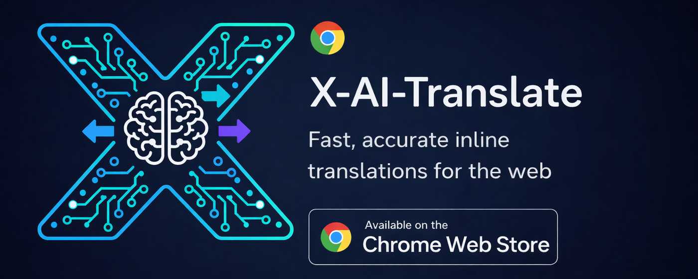

# AI Translate для X и YouTube

Chrome Web Store: https://chromewebstore.google.com/detail/ai-translate-for-x-and-yo/ccgnhaicdhdhhangmfkddcippajhbbji

Расширение Chrome для перевода выделенного текста, сообщений X (Twitter) и комментариев YouTube через AI-провайдеров или специализированные сервисы перевода.

## Функции
- Переведите выделенный текст с помощью контекстного меню или горячей клавиши `Alt+Shift+T` (потоковый вывод).
- Кнопка встроенного перевода под X постами/ответами и комментариями YouTube (потоковая передача).
- Дополнительная кнопка быстрого перевода рядом с выделением текста.
- Поддерживает OpenAI, Claude, Gemini, DeepSeek, YandexGPT, OpenRouter, Google Translate, DeepL API Free и пользовательские конечные точки, совместимые с OpenAI.
- Google Translate работает без API-ключа через бесплатный веб-эндпоинт; DeepL использует официальный бесплатный план API.
- Список моделей OpenRouter с бесплатным фильтром и кешем.
- Списки моделей автозагрузки для OpenAI, Claude, Gemini, DeepSeek, OpenRouter и YandexGPT.
- Режимы вывода: тост в правом нижнем углу или модальное окно по центру (без вывода всплывающего окна расширения).
- Выбор целевого + исходного языка (доступно автоопределение).
- Ключи API могут храниться локально (по умолчанию) или синхронизироваться между устройствами (необязательно, менее безопасно).
- Результаты сохраняются во всплывающем окне «Последний перевод/Последняя ошибка».

## Использование
1. Откройте всплывающее окно → нажмите **Settings** (страница параметров).
2. Выберите провайдера. Для Google Translate ключ не нужен, а для DeepL API Free нужен API-ключ DeepL. Для OpenAI и Claude также доступен дополнительный локальный режим подписки через [AI Translate Bridge](https://github.com/ivst/X-AI-Translate-Bridge).
3. На любой странице выделите текст и используйте контекстное меню или горячую клавишу.
4. В X и комментариях YouTube нажмите «Перевести текст» под поддерживаемым блоком контента, чтобы увидеть встроенный перевод. Эти кнопки можно отключить в разделе Settings.

## Настройки (страница «Параметры»)
- Предустановки поставщика и пользовательская конечная точка.
- Прямые сервисы перевода: Google Translate (бесплатный веб-эндпоинт без ключа) и DeepL API Free (бесплатная квота, ключ API обязателен).
- Обновление/загрузка моделей для OpenAI, Claude, Gemini, DeepSeek, OpenRouter (пользовательские/публичные, только бесплатные) и YandexGPT.
- Переключатель режима рассуждений DeepSeek (по умолчанию выключен для быстрого перевода).
- Режим вывода + продолжительность наложения.
- Кнопка быстрого выбора.
- Отдельные переключатели для показа кнопок перевода в X и YouTube.
- Дополнительная синхронизация ключей API между устройствами с предупреждением безопасности.
- Необязательный автоперевод видимых постов X и комментариев YouTube (по умолчанию выключен).
- Необязательный режим подписки для OpenAI (Codex) и Claude (Claude Code); режим API-ключа остаётся основным.

## Режим подписки

Режим подписки включается вручную и требует отдельно скачанного [AI Translate Bridge](https://github.com/ivst/X-AI-Translate-Bridge) и авторизованного CLI провайдера. Установите bundle bridge, затем выберите режим «Подписка» в настройках. Gemini и остальные провайдеры продолжают работать через существующий режим API-ключа.

## Разрешения
- Скрипт контента работает на `<all_urls>`, чтобы отслеживать выделение текста и показывать встроенный интерфейс перевода там, где это поддерживается.
- `contextMenus`, `storage`, `activeTab`, `scripting`, `notifications`
- Разрешения хоста для настроенных поставщиков API и API X/Twitter

## Разработка
- Загрузить распакованный в `chrome://extensions`
- Входные файлы: `background.js`, `content.js`, `popup.html`, `popup.js`, `options.html`, `options.js`
- Для сборки архива Chrome Web Store выполните `node package-extension.mjs`. Папка локального bridge и файлы его установки в пакет не входят; не загружайте в магазин корень репозитория напрямую.

## Конфиденциальность
Выделенный текст отправляется только на настроенную вами конечную точку API или в локальный bridge при включённом режиме подписки.
См. `PRIVACY_POLICY.md`.

## Контакт
- Электронная почта: `xtran@msk.onl`

## Текущий релиз (0.3.0)
- Поддерживается только режим BYOK/API-ключей; bridge и native host для подписок не входят в расширение.
- Google Translate выбран провайдером по умолчанию и работает без API-ключа. Для DeepL API Free нужен API-ключ DeepL.
- Автоматический перевод видимых постов X и комментариев YouTube можно включить в настройках; по умолчанию он выключен.
- Режим рассуждений DeepSeek по умолчанию выключен, чтобы сократить задержку перевода.

